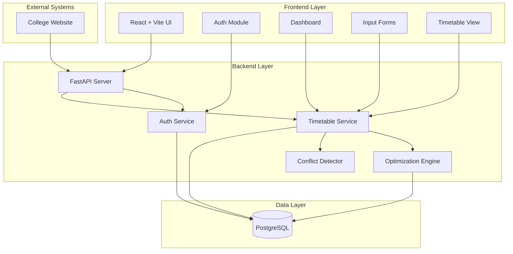

# Design Document: College Timetable Scheduling System

## Overview

The College Timetable Scheduling System is a full-stack web application that automates academic timetable generation using constraint satisfaction algorithms. The system consists of a React frontend for user interaction, a FastAPI backend for business logic and API endpoints, a PostgreSQL database for data persistence, and a Python-based optimization engine using OR-Tools or PuLP for constraint solving.

The architecture follows a three-tier pattern: presentation layer (React), application layer (FastAPI), and data layer (PostgreSQL). The optimization engine is integrated as a service within the backend, processing scheduling constraints and generating multiple timetable options.

## Architecture

### System Architecture



### Technology Stack

- **Frontend**: React 18+ with Vite, React Router for navigation, Axios for API calls
- **Backend**: Python 3.10+ with FastAPI, Pydantic for validation
- **Database**: PostgreSQL 14+ with SQLAlchemy ORM
- **Optimization**: OR-Tools or PuLP for constraint satisfaction
- **Authentication**: JWT tokens with python-jose
- **API Documentation**: OpenAPI/Swagger (auto-generated by FastAPI)

### Deployment Architecture

- Frontend: Static files served via Nginx or CDN
- Backend: FastAPI application running on Uvicorn/Gunicorn
- Database: PostgreSQL instance with connection pooling
- All components containerizable with Docker

## Components and Interfaces

### Frontend Components

#### 1. Authentication Module

**Responsibility**: Handle user login, token management, and session state.

**Interface**:
```typescript
interface AuthModule {
  login(username: string, password: string): Promise<AuthResponse>
  logout(): void
  isAuthenticated(): boolean
  getToken(): string | null
  refreshToken(): Promise<void>
}

interface AuthResponse {
  access_token: string
  token_type: string
  expires_in: number
}
```

#### 2. Dashboard Component

**Responsibility**: Display overview of timetables, recent activities, and quick actions.

**Interface**:
```typescript
interface DashboardProps {
  user: User
}

interface DashboardData {
  activeTimetable: TimetableOption | null
  pendingApprovals: number
  recentChanges: ChangeLog[]
  utilizationStats: UtilizationStats
}
```

#### 3. Input Forms Component

**Responsibility**: Collect and validate all scheduling input data.

**Interface**:
```typescript
interface InputFormsProps {
  onSubmit: (data: InputData) => Promise<void>
  initialData?: InputData
}

interface InputData {
  classrooms: Classroom[]
  batches: Batch[]
  subjects: Subject[]
  faculty: Faculty[]
  constraints: SchedulingConstraints
  fixedSlots: FixedSlot[]
  electivePreferences: ElectivePreference[]
}
```

#### 4. Timetable View Component

**Responsibility**: Display timetables in grid and list formats with filtering.

**Interface**:
```typescript
interface TimetableViewProps {
  timetableId: string
  viewMode: 'grid' | 'list'
  filterBy?: FilterOptions
}

interface FilterOptions {
  department?: string
  batch?: string
  faculty?: string
  classroom?: string
}
```

### Backend Services

#### 1. Authentication Service

**Responsibility**: Validate credentials, generate JWT tokens, manage sessions.

**Interface**:
```python
class AuthService:
    def authenticate_user(username: str, password: str) -> User | None
    def create_access_token(user_id: int) -> str
    def verify_token(token: str) -> TokenPayload | None
    def hash_password(password: str) -> str
    def verify_password(plain_password: str, hashed_password: str) -> bool
```

#### 2. Timetable Service

**Responsibility**: Orchestrate timetable generation, storage, and retrieval.

**Interface**:
```python
class TimetableService:
    def generate_timetables(input_data: InputData) -> list[TimetableOption]
    def get_timetable(timetable_id: int) -> TimetableOption
    def approve_timetable(timetable_id: int, admin_id: int) -> bool
    def reject_timetable(timetable_id: int, admin_id: int, comments: str) -> bool
    def get_active_timetable() -> TimetableOption | None
    def apply_realtime_adjustment(adjustment: Adjustment) -> TimetableOption
    def export_timetable(timetable_id: int, format: str) -> bytes
```

#### 3. Optimization Engine

**Responsibility**: Solve constraint satisfaction problem and generate optimal timetables.

**Interface**:
```python
class OptimizationEngine:
    def __init__(solver_type: str)  # 'ortools' or 'pulp'
    def add_constraint(constraint: Constraint) -> None
    def set_objective(objective: Objective) -> None
    def solve() -> list[Solution]
    def get_solution_quality(solution: Solution) -> float
```

**Constraints**:
- No faculty double-booking
- No classroom double-booking
- Faculty availability
- Room capacity
- Fixed slots
- Classes per day/week limits
- Elective student preferences

**Objective**:
- Maximize classroom utilization (target: 80%+)
- Minimize faculty workload variance
- Maximize student preference satisfaction

#### 4. Conflict Detector

**Responsibility**: Identify scheduling conflicts and suggest resolutions.

**Interface**:
```python
class ConflictDetector:
    def detect_conflicts(timetable: TimetableOption) -> list[Conflict]
    def suggest_resolutions(conflict: Conflict) -> list[Resolution]
    def validate_timetable(timetable: TimetableOption) -> ValidationResult
```

**Conflict Types**:
- Faculty double-booking
- Classroom double-booking
- Capacity violations
- Availability violations
- Fixed slot violations

### API Endpoints

#### Authentication Endpoints

```
POST /api/auth/login
  Request: { username: string, password: string }
  Response: { access_token: string, token_type: string, expires_in: number }

POST /api/auth/refresh
  Request: { refresh_token: string }
  Response: { access_token: string }
```

#### Input Data Endpoints

```
POST /api/classrooms
  Request: Classroom[]
  Response: { success: boolean, ids: number[] }

POST /api/batches
  Request: Batch[]
  Response: { success: boolean, ids: number[] }

POST /api/subjects
  Request: Subject[]
  Response: { success: boolean, ids: number[] }

POST /api/faculty
  Request: Faculty[]
  Response: { success: boolean, ids: number[] }

POST /api/constraints
  Request: SchedulingConstraints
  Response: { success: boolean }
```

#### Timetable Endpoints

```
POST /api/timetables/generate
  Request: { input_data_id: number }
  Response: { timetable_options: TimetableOption[] }

GET /api/timetables/{id}
  Response: TimetableOption

POST /api/timetables/{id}/approve
  Request: { admin_id: number }
  Response: { success: boolean }

POST /api/timetables/{id}/reject
  Request: { admin_id: number, comments: string }
  Response: { success: boolean }

GET /api/timetables/active
  Response: TimetableOption | null

POST /api/timetables/{id}/adjust
  Request: Adjustment
  Response: TimetableOption

GET /api/timetables/{id}/export?format=pdf|excel
  Response: Binary file
```

#### Conflict Detection Endpoints

```
GET /api/timetables/{id}/conflicts
  Response: { conflicts: Conflict[] }

POST /api/conflicts/{id}/resolve
  Request: Resolution
  Response: { success: boolean, updated_timetable: TimetableOption }
```

## Data Models

### User

```python
class User:
    id: int
    username: str
    password_hash: str
    role: str  # 'admin'
    created_at: datetime
    last_login: datetime
```

### Classroom

```python
class Classroom:
    id: int
    name: str
    capacity: int
    type: str  # 'classroom' or 'lab'
    building: str
    floor: int
    available: bool
```

### Batch

```python
class Batch:
    id: int
    name: str
    program: str  # 'UG' or 'PG'
    department: str
    year: int
    semester: int
    student_count: int
    shift: str  # 'morning', 'afternoon', 'evening'
```

### Subject

```python
class Subject:
    id: int
    code: str
    name: str
    department: str
    type: str  # 'core', 'elective', 'lab'
    credits: int
    hours_per_week: int
    requires_lab: bool
```

### Faculty

```python
class Faculty:
    id: int
    name: str
    employee_id: str
    department: str
    email: str
    max_hours_per_week: int
    availability: list[TimeSlot]
    leaves: list[LeaveRecord]
```

### TimeSlot

```python
class TimeSlot:
    id: int
    day: str  # 'Monday', 'Tuesday', etc.
    start_time: time
    end_time: time
    slot_number: int
```

### FixedSlot

```python
class FixedSlot:
    id: int
    subject_id: int
    faculty_id: int
    batch_id: int
    classroom_id: int
    time_slot_id: int
    reason: str
```

### ElectivePreference

```python
class ElectivePreference:
    id: int
    student_id: int
    batch_id: int
    subject_id: int
    priority: int  # 1 = first choice, 2 = second choice, etc.
```

### SchedulingConstraints

```python
class SchedulingConstraints:
    id: int
    classes_per_day_min: int
    classes_per_day_max: int
    classes_per_week: int
    break_duration_minutes: int
    lunch_break_start: time
    lunch_break_end: time
    target_utilization_rate: float  # 0.8 for 80%
```

### TimetableOption

```python
class TimetableOption:
    id: int
    name: str
    generated_at: datetime
    status: str  # 'draft', 'approved', 'rejected', 'active'
    utilization_rate: float
    conflict_count: int
    quality_score: float
    entries: list[TimetableEntry]
    approval_log: list[ApprovalRecord]
```

### TimetableEntry

```python
class TimetableEntry:
    id: int
    timetable_id: int
    subject_id: int
    faculty_id: int
    batch_id: int
    classroom_id: int
    time_slot_id: int
    is_fixed: bool
```

### Conflict

```python
class Conflict:
    id: int
    timetable_id: int
    type: str  # 'faculty_double_booking', 'classroom_double_booking', etc.
    severity: str  # 'critical', 'warning'
    description: str
    affected_entries: list[int]  # TimetableEntry IDs
    suggested_resolutions: list[Resolution]
```

### Resolution

```python
class Resolution:
    id: int
    conflict_id: int
    description: str
    changes: dict  # Proposed changes to resolve conflict
    impact_score: float
```

### Adjustment

```python
class Adjustment:
    id: int
    timetable_id: int
    type: str  # 'faculty_leave', 'classroom_unavailable', 'manual_change'
    affected_entry_id: int
    new_faculty_id: int | None
    new_classroom_id: int | None
    new_time_slot_id: int | None
    reason: str
    created_by: int
    created_at: datetime
```

### ApprovalRecord

```python
class ApprovalRecord:
    id: int
    timetable_id: int
    admin_id: int
    action: str  # 'approved', 'rejected'
    comments: str
    timestamp: datetime
```

### ChangeLog

```python
class ChangeLog:
    id: int
    timetable_id: int
    user_id: int
    action: str
    description: str
    timestamp: datetime
```

## Correctness Properties

*A property is a characteristic or behavior that should hold true across all valid executions of a system—essentially, a formal statement about what the system should do. Properties serve as the bridge between human-readable specifications and machine-verifiable correctness guarantees.*


### Property 1: Valid credentials produce JWT tokens

*For any* valid username and password combination, authenticating with those credentials should return a valid JWT token that can be verified.

**Validates: Requirements 1.1**

### Property 2: Invalid credentials are rejected

*For any* invalid username or password combination, authentication attempts should be rejected with an appropriate error response.

**Validates: Requirements 1.2**

### Property 3: Expired tokens require re-authentication

*For any* JWT token that has passed its expiration time, attempts to use that token should be rejected and require re-authentication.

**Validates: Requirements 1.3**

### Property 4: Authenticated sessions persist

*For any* authenticated user, the session state should remain valid across multiple requests until logout or token expiration.

**Validates: Requirements 1.4**

### Property 5: Protected routes reject unauthenticated access

*For any* protected API endpoint, requests without valid authentication tokens should be rejected with 401 Unauthorized status.

**Validates: Requirements 1.5**

### Property 6: Faculty availability round-trip

*For any* faculty member with availability data, storing the availability and then retrieving it should produce equivalent availability information.

**Validates: Requirements 2.5**

### Property 7: Leave marks slots unavailable

*For any* faculty member, when leave is recorded for specific time slots, those slots should be marked as unavailable in the faculty's availability.

**Validates: Requirements 2.6**

### Property 8: Fixed slots are immutable

*For any* timetable generated with fixed slot constraints, all fixed slots should remain unchanged in the generated timetable.

**Validates: Requirements 2.7, 3.5**

### Property 9: Elective preferences round-trip

*For any* student with elective preferences, storing the preferences and then retrieving them should produce equivalent preference data.

**Validates: Requirements 2.8**

### Property 10: Input validation rejects invalid data

*For any* input data that violates completeness or consistency rules, the validation function should reject it and provide specific error messages.

**Validates: Requirements 2.9**

### Property 11: Data updates invalidate timetables

*For any* modification to input data (classrooms, faculty, subjects, etc.), all timetables that depend on that data should be marked as invalid or outdated.

**Validates: Requirements 2.10**

### Property 12: No faculty double-booking

*For any* generated timetable, no faculty member should be assigned to more than one class in the same time slot.

**Validates: Requirements 3.2**

### Property 13: No classroom double-booking

*For any* generated timetable, no classroom should be assigned to more than one class in the same time slot.

**Validates: Requirements 3.3**

### Property 14: Faculty availability respected

*For any* generated timetable, all class assignments should fall within the assigned faculty member's available time slots.

**Validates: Requirements 3.4**

### Property 15: Room capacity constraints satisfied

*For any* generated timetable, the batch size for each class should not exceed the capacity of the assigned classroom.

**Validates: Requirements 3.6**

### Property 16: Utilization rate meets target

*For any* generated timetable, the classroom utilization rate should be at least 80% (or the configured target rate).

**Validates: Requirements 3.7**

### Property 17: Multiple timetable options generated

*For any* timetable generation request, the system should produce at least 3 distinct timetable options.

**Validates: Requirements 3.8**

### Property 18: Student preferences accommodated

*For any* generated timetable with elective subjects, students should be assigned to their highest-priority available elective choice.

**Validates: Requirements 3.9**

### Property 19: Generated timetables are persisted

*For any* completed timetable generation operation, all generated timetable options should be stored in the database and retrievable by ID.

**Validates: Requirements 3.12**

### Property 20: All conflict types detected

*For any* timetable containing conflicts (faculty double-booking, classroom double-booking, capacity violations, or availability violations), the conflict detector should identify all conflicts present.

**Validates: Requirements 4.1, 4.2, 4.3, 4.4, 4.5**

### Property 21: Conflicts have resolution suggestions

*For any* detected conflict, the system should provide at least one resolution suggestion.

**Validates: Requirements 4.6**

### Property 22: Resolution triggers re-validation

*For any* conflict resolution applied to a timetable, the system should re-validate the entire timetable to detect any new conflicts introduced.

**Validates: Requirements 4.8**

### Property 23: Timetable entries contain complete information

*For any* timetable entry, it should contain all required fields: subject name, faculty, classroom, batch, and time slot.

**Validates: Requirements 5.3**

### Property 24: Filtering returns matching results

*For any* filter criteria (department, batch, faculty, or classroom), the filtered timetable results should only include entries that match the specified criteria.

**Validates: Requirements 5.4**

### Property 25: Approval sets active timetable

*For any* timetable that is approved by an admin, the system should mark it as approved and set it as the active timetable.

**Validates: Requirements 6.2**

### Property 26: Rejection stores comments

*For any* timetable that is rejected by an admin with comments, the system should store the rejection status and comments in the approval record.

**Validates: Requirements 6.3**

### Property 27: Approval actions are audited

*For any* approval or rejection action, the system should create an audit log entry with timestamp, admin ID, action type, and comments.

**Validates: Requirements 6.4**

### Property 28: Only approved timetables exportable

*For any* timetable that is not in approved status, export operations should be rejected.

**Validates: Requirements 6.5**

### Property 29: Faculty leave identifies affected classes

*For any* faculty leave record added to the system, all classes in the active timetable taught by that faculty during the leave period should be identified as affected.

**Validates: Requirements 7.1**

### Property 30: Classroom unavailability identifies affected classes

*For any* classroom marked as unavailable, all classes in the active timetable scheduled in that classroom during the unavailable period should be identified as affected.

**Validates: Requirements 7.2**

### Property 31: Adjustments provide suggestions

*For any* real-time adjustment that affects classes, the system should suggest alternative time slots, faculty, or classrooms.

**Validates: Requirements 7.3**

### Property 32: Adjustments validated for conflicts

*For any* adjustment applied to a timetable, the system should validate that no new conflicts are introduced by the change.

**Validates: Requirements 7.5**

### Property 33: Adjustments are logged

*For any* real-time adjustment made to a timetable, the system should create a change log entry with timestamp, user ID, adjustment type, and reason.

**Validates: Requirements 7.6**

### Property 34: Mixed batches in electives

*For any* elective class, students from different batches should be allowed to enroll in the same class section.

**Validates: Requirements 8.4**

### Property 35: Elective groups formed by preferences

*For any* set of students with the same elective preference, the system should group them together in the same class section when scheduling.

**Validates: Requirements 8.5**

### Property 36: Export includes complete information

*For any* timetable exported to PDF or Excel format, the exported file should include all required fields: subject, faculty, classroom, batch, and time slot for each entry.

**Validates: Requirements 9.3**

### Property 37: API requires authentication

*For any* API endpoint that accesses timetable data, requests without valid JWT tokens should be rejected with 401 Unauthorized status.

**Validates: Requirements 9.6**

### Property 38: API returns valid JSON

*For any* successful API request for timetable data, the response should be valid JSON that can be parsed without errors.

**Validates: Requirements 9.7**

### Property 39: Resources shared across departments

*For any* timetable with multiple departments, classrooms and labs should be assignable to classes from different departments in non-overlapping time slots.

**Validates: Requirements 10.4**

### Property 40: Referential integrity maintained

*For any* attempt to delete or modify data that is referenced by other entities (e.g., deleting a faculty member assigned to classes), the system should reject the operation or cascade the changes appropriately.

**Validates: Requirements 12.3**

## Error Handling

### Authentication Errors

- **Invalid Credentials**: Return 401 Unauthorized with message "Invalid username or password"
- **Expired Token**: Return 401 Unauthorized with message "Token has expired, please login again"
- **Missing Token**: Return 401 Unauthorized with message "Authentication required"
- **Invalid Token**: Return 401 Unauthorized with message "Invalid authentication token"

### Input Validation Errors

- **Missing Required Fields**: Return 400 Bad Request with list of missing fields
- **Invalid Data Types**: Return 400 Bad Request with field name and expected type
- **Constraint Violations**: Return 400 Bad Request with specific constraint violated
- **Duplicate Entries**: Return 409 Conflict with message identifying the duplicate

### Optimization Errors

- **No Solution Found**: Return 422 Unprocessable Entity with message "Unable to generate valid timetable with given constraints"
- **Insufficient Resources**: Return 422 Unprocessable Entity with message "Insufficient classrooms or time slots to accommodate all classes"
- **Conflicting Constraints**: Return 422 Unprocessable Entity with list of conflicting constraints

### Database Errors

- **Connection Failure**: Return 503 Service Unavailable with message "Database temporarily unavailable"
- **Transaction Failure**: Rollback transaction and return 500 Internal Server Error
- **Referential Integrity Violation**: Return 409 Conflict with message explaining the dependency

### Export Errors

- **Timetable Not Found**: Return 404 Not Found with message "Timetable not found"
- **Timetable Not Approved**: Return 403 Forbidden with message "Only approved timetables can be exported"
- **Export Generation Failed**: Return 500 Internal Server Error with message "Failed to generate export file"

### Error Response Format

All error responses follow this JSON structure:

```json
{
  "error": {
    "code": "ERROR_CODE",
    "message": "Human-readable error message",
    "details": {
      "field": "Additional context",
      "timestamp": "2024-01-01T12:00:00Z"
    }
  }
}
```

## Testing Strategy

### Dual Testing Approach

The system will employ both unit testing and property-based testing to ensure comprehensive coverage:

- **Unit tests**: Verify specific examples, edge cases, and error conditions
- **Property tests**: Verify universal properties across all inputs using randomized test data

Both testing approaches are complementary and necessary. Unit tests catch concrete bugs in specific scenarios, while property tests verify general correctness across a wide range of inputs.

### Unit Testing

Unit tests will focus on:

- **Specific examples**: Testing known scenarios with concrete data
- **Edge cases**: Empty inputs, boundary values, maximum capacities
- **Error conditions**: Invalid inputs, missing data, constraint violations
- **Integration points**: API endpoints, database operations, authentication flows

**Testing Framework**: pytest for backend, Jest/Vitest for frontend

**Coverage Target**: Minimum 80% code coverage

### Property-Based Testing

Property tests will verify the correctness properties defined in this document using randomized test data.

**Testing Library**: Hypothesis for Python (backend)

**Configuration**:
- Minimum 100 iterations per property test
- Each test tagged with format: **Feature: college-timetable-scheduling, Property {number}: {property_text}**
- Each correctness property implemented by a SINGLE property-based test

**Property Test Examples**:

```python
# Feature: college-timetable-scheduling, Property 12: No faculty double-booking
@given(timetables())
def test_no_faculty_double_booking(timetable):
    for slot in timetable.time_slots:
        faculty_in_slot = [entry.faculty_id for entry in timetable.entries 
                          if entry.time_slot_id == slot.id]
        assert len(faculty_in_slot) == len(set(faculty_in_slot)), \
            "Faculty double-booking detected"

# Feature: college-timetable-scheduling, Property 15: Room capacity constraints satisfied
@given(timetables())
def test_room_capacity_satisfied(timetable):
    for entry in timetable.entries:
        batch = get_batch(entry.batch_id)
        classroom = get_classroom(entry.classroom_id)
        assert batch.student_count <= classroom.capacity, \
            f"Batch size {batch.student_count} exceeds room capacity {classroom.capacity}"
```

### Test Data Generation

Property-based tests require generators for creating random valid test data:

- **Classroom Generator**: Random capacity (20-200), type (classroom/lab), building, floor
- **Batch Generator**: Random program (UG/PG), department, year, student count (20-100)
- **Subject Generator**: Random name, department, type, credits, hours per week
- **Faculty Generator**: Random name, department, availability slots, max hours
- **Timetable Generator**: Random valid timetable satisfying basic constraints
- **Conflict Generator**: Timetables with intentional conflicts for testing detection

### Integration Testing

Integration tests will verify:

- End-to-end timetable generation workflow
- API authentication and authorization
- Database transactions and rollbacks
- Export functionality (PDF/Excel generation)
- Real-time adjustment workflows

### Performance Testing

Performance tests will verify:

- Timetable generation completes within 30 seconds for typical college size (50 faculty, 30 batches)
- API response times under 200ms for data retrieval
- Database query performance with realistic data volumes
- Concurrent user handling (minimum 50 simultaneous users)

### Test Environment

- **Development**: Local PostgreSQL, mock data
- **CI/CD**: Automated test execution on every commit
- **Staging**: Full integration tests with production-like data
- **Production**: Smoke tests after deployment
